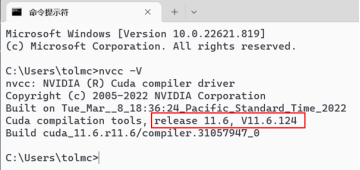
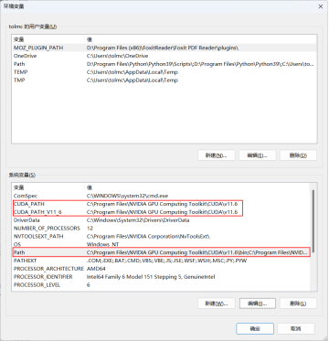

1.2.2 安装GPU 加速包
==============================

由于只使用CPU运行深度学习框架所花费的时间往往较长，如卷积神经网络的图像处理和循环神经网络的序列处理，即便在多核多线程高主频CPU上的运行速度也较慢。而利用当前主流NVIDIA
GPU进行深度学习实验时，通常速度可以提高5倍甚至更高[6]
，因此推荐读者利用GPU进行深度学习实验。在安装GPU加速包之前，须先检查计算机上是否有支持CUDA的GPU，读者可根据电脑的显卡型号在Nvidia官方网站的查询网址[7]
查看显卡是否支持CUDA。进而查询当前驱动程序最高可支持的CUDA版本（Window系统查看方法：桌面上点击鼠标右键，在弹出菜单中依次选择NVIDIA控制面板帮助系统信息组件），如图1-2所示（图中表示显卡驱动最高支持CUDA11.7）。

确认显卡驱动支持的最高CUDA版本后，即可在Nvidia官方网站的CUDA下载网址[8]
根据操作系统版本选择相应的CUDA版本,此处下载的是CUDA11.6.2版本，下载完成后根据程序提示进行安装。

安装完成后，Windows系统须在cmd窗口中输入命令“nvcc
-V”检查CUDA是否安装成功。如显示的信息中含有“…release
xx.x…”等提示，则说明CUDA已成功安装，如图1-3所示。否则，说明安装失败，则需要检查CUDA的安装路径是否已成功添加至系统环境变量中，如未添加则需按下述方法手动添加，完成后重启电脑并重复上述步骤。

添加CUDA安装路径至系统环境变量：右键点击我的电脑，在弹出的菜单中依次选择“属性系统高级系统设置高级环境变量”，检查系统变量是否有如图1-4中红框所示的内容，若没有则需在系统环境变量Path中添加以下路径。方法是：依次点击系统变量中的“Path编辑新建”，将以下变量全部添加进去后点击确定（需要注意的是，如下路径中的V11.6应改成相应电脑显卡驱动所对应的版本号）。

    C:\Program Files\NVIDIA GPU Computing Toolkit\CUDA\v11.6\lib\x64
    C:\Program Files\NVIDIA GPU Computing Toolkit\CUDA\v11.6\include
    C:\Program Files\NVIDIA GPU Computing Toolkit\CUDA\v11.6\extras\CUPTI\lib64
    C:\Program Files\NVIDIA GPU Computing Toolkit\CUDA\v11.6\bin

安装完成后，打开MiniConda，在命令行中输入python并回车，查看安装的版本，如图1-5红框中的内容即是当前安装的Python版本号。查看完成后，输入quit()或按ctrl+z回车退出Python交互式环境。若未显示图1-5所示的界面，请转前述安装步骤重新安装环境

